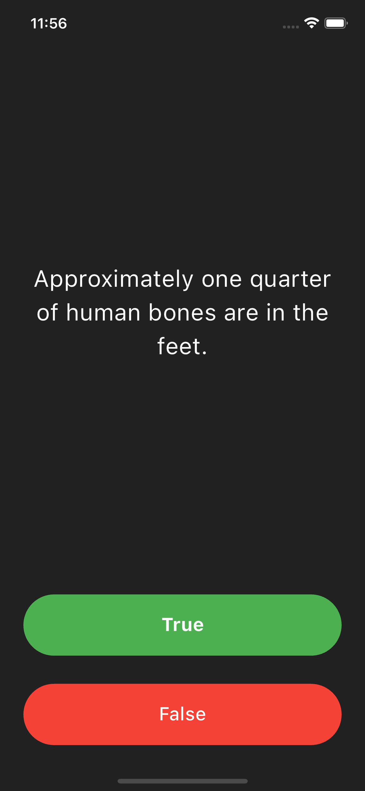
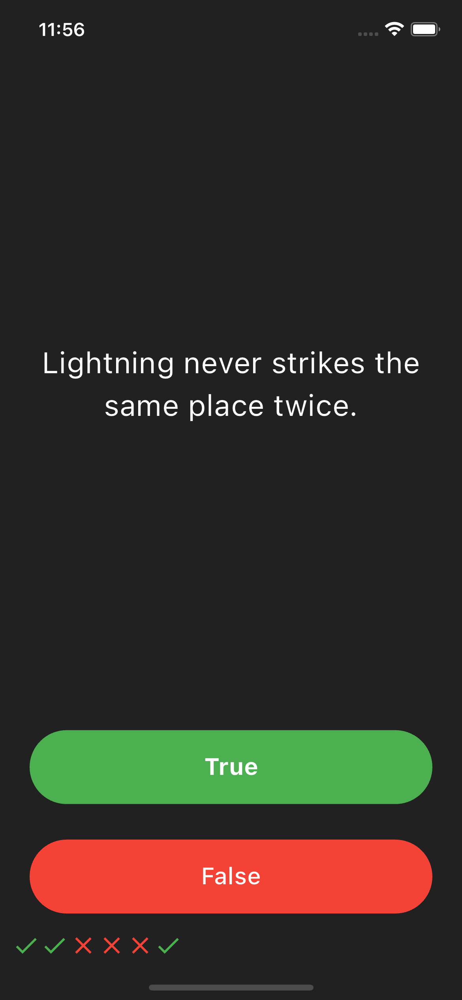
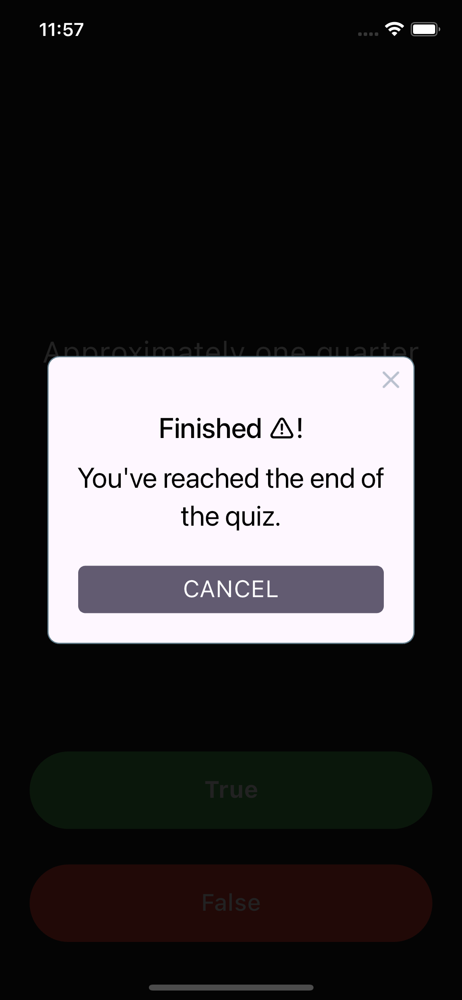

# Quiz App

It is a simple quiz app built with Flutter that tests your knowledge with true/false questions.

## Features

- Multiple true/false questions
- Score tracking
- Reset functionality

## Screenshots!

## Getting Started

To run this project locally, follow these steps:

1. Clone this repository.
2. Open the project in your preferred IDE (e.g., Android Studio, VS Code).
3. Ensure Flutter is set up and configured correctly.
4. Run the app on a simulator/emulator or a physical device.

## Usage

- Answer each question by tapping either the True or False button.
- View your score and see icons indicating correct (✔️) or incorrect (❌) answers.
- Once all questions are answered, the quiz resets automatically.

## Dependencies

- rflutter_alert: ^1.0.3

